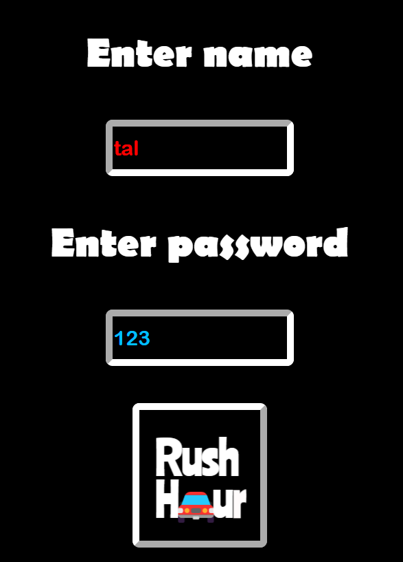
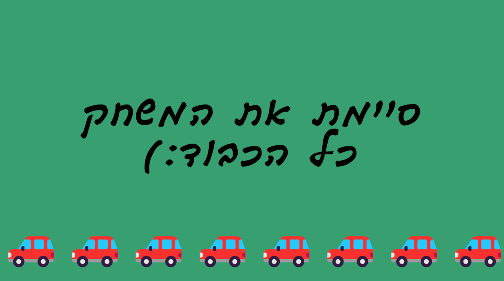

# Red Car Game

**Red Car  Game** is a JavaScript game where players navigate obstacles to free a red car. The goal is to move other cars and clear the path for the red car to exit.

## Game Overview

In this puzzle game:
- The player’s goal is to free the red car by strategically moving other vehicles.
- Each level becomes progressively more challenging.

## How to Play

1. Open `enter.html` in a web browser.
2. Use your mouse to move the cars.
3. Clear a path for the red car to reach the exit.

## Screenshots

Below are some images showcasing the game:

<p align="center">
  
  
  
</p>

## Installation

1. Clone this repository:
   ```bash
   git clone https://github.com/MalkiApplebaum/RushHour.git
